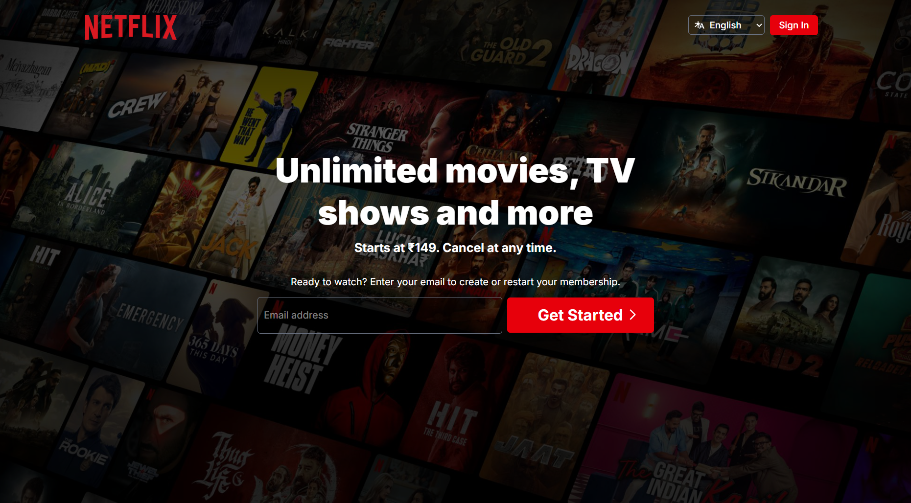
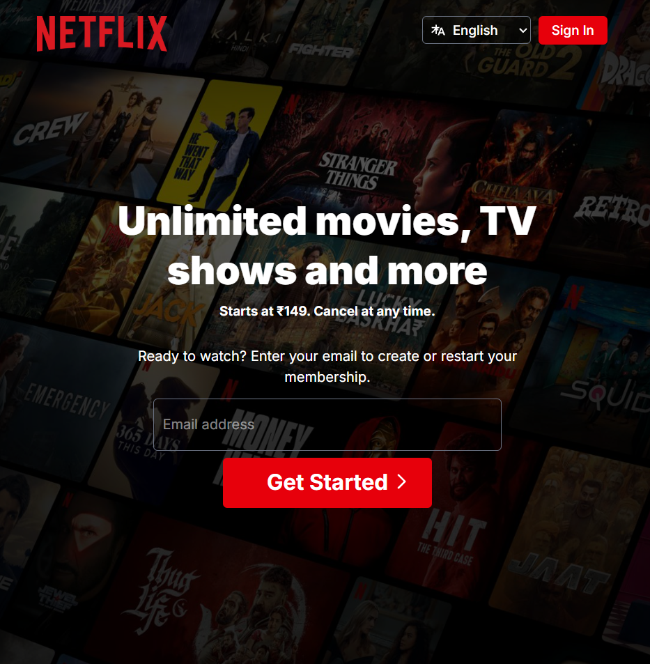
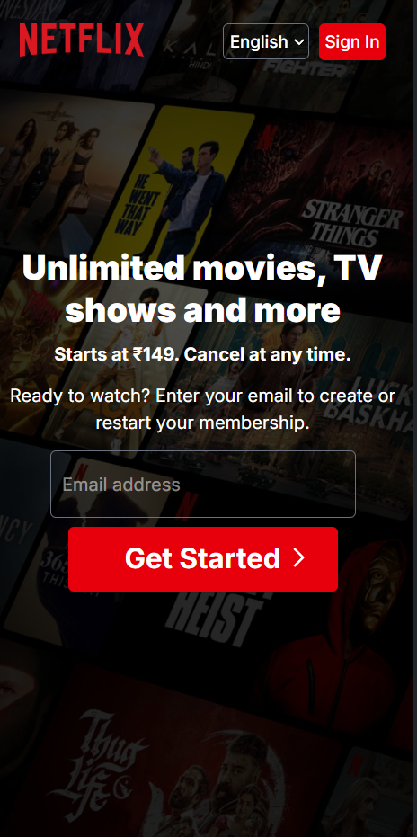

# 🎬 Netflix UI Clone

A **pixel-perfect Netflix UI clone** built using **HTML**, **Tailwind CSS**, and **JavaScript**.  
This responsive clone mimics the core layout and styling of the real Netflix landing page, offering a modern, visually appealing design that works seamlessly across devices.


---

## 🌐 Live Demo

🔗 **Live Website:** [https://krishnajain-dev.github.io/netflix-ui-clone](https://krishnajain-dev.github.io/netflix-ui-clone)
  
---

## 📸 Features

- ✅ Pixel-perfect layout inspired by Netflix  
- ✅ Clean and responsive design using Tailwind CSS  
- ✅ Custom hero section with background image and gradient overlay  
- ✅ Styled navigation bar with logo and sign-in button  
- ✅ Functional FAQ accordion with JavaScript  
- ✅ Responsive grid layout for device support showcase  
- ✅ Mobile-first, fully responsive UI

---

## 🛠️ Tech Stack

- **HTML5** – Semantic and accessible structure  
- **Tailwind CSS** – Utility-first CSS framework for rapid UI building  
- **JavaScript** – For FAQ toggle and basic interactivity  

---

## 📱 Responsive Design

Designed with **mobile-first** principles. Works perfectly on:

- 📱 Mobile  
- 💻 Laptop  
- 🖥️ Desktop  
- 📟 Tablet  

---

## 🖼 Preview

### Desktop View

<p align="center">
  
</p>

---

### Tablet View

<p align="center">
  
</p>

---

### Mobile View

<p align="center">
  
</p>


---


## 📁 Folder Structure

```
netflix/
├── index.html
├── /assets/
│ └── images, screenshots, favicon, svg.

```
---

## 🧠 What I Learned

- Practiced building a pixel-perfect UI from a real-world design reference  
- Gained hands-on experience with Tailwind CSS utility classes  
- Improved responsiveness and layout design across screen sizes  
- Used JavaScript to implement interactive accordion elements

---

## 🛠️ Getting Started

To run this project locally, follow these steps:

1. **Clone the repository to your local machine:**
   ```bash
   git clone https://github.com/Krishnajaindev/netflix-ui-clone.git
    ```

2. **Navigate into the project directory:**

   ```bash
   cd airbnb
   ```

3. **Open the `index.html` file in your web browser.**

   * You can double-click the file, or
   * Right-click → "Open with" → choose your browser

---

## 📫 Connect With Me

* ✉️ [krishnajain.dev@gmail.com](mailto:krishnajain.dev@gmail.com)
* 🔗 [LinkedIn](https://www.linkedin.com/in/krishnajaindev/)
* 💻 [GitHub](https://github.com/krishnajaindev)

---

## ⚡ License

This project is open source under the [MIT License](LICENSE).

---